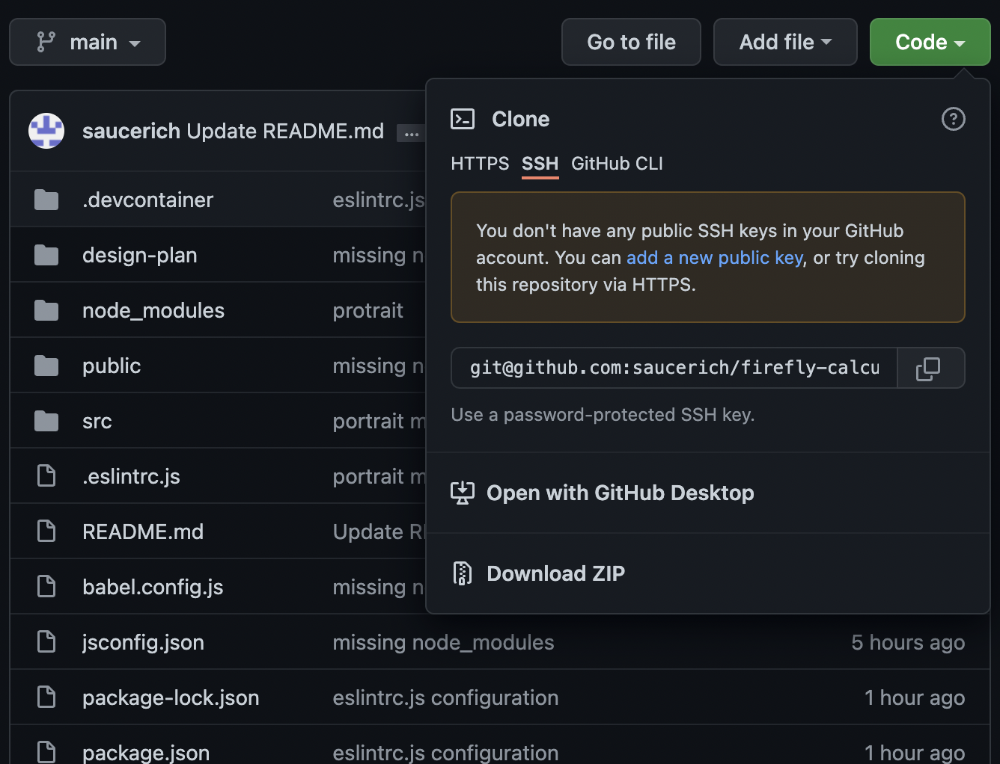
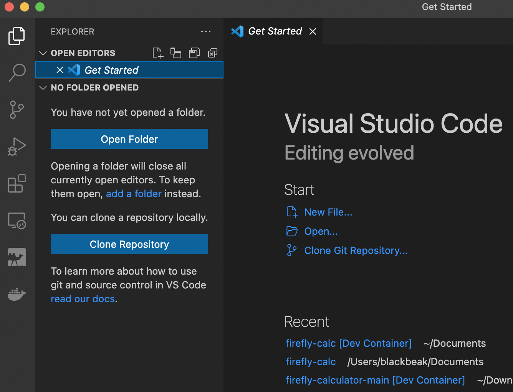
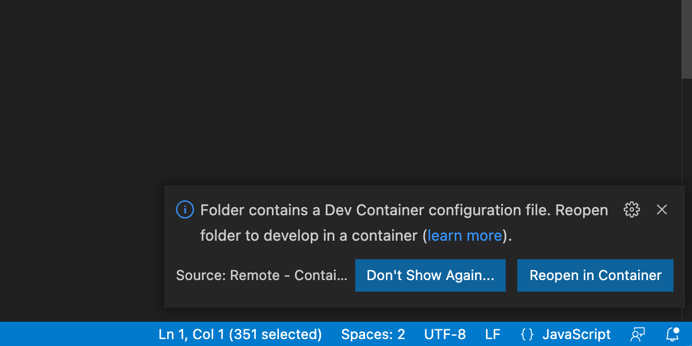

# Directions

## Download 

1. Download the file by clicking the green "Code" button and selecting "Download ZIP" from the slidedown menu


(Alternatively you can clone the project using your desired software)

## Openning the project files

1. Open the project in your desired editing software. I use Visual Studio Code (Download VS code: https://code.visualstudio.com/)

### Opening in VS Code:



1. Click "Open Folder" and select the folder

2. If it prompts you with "Do you Trust the authors of the files in this folder" select "Yes, I trust the authors"

3. When it prompts you to download extensions, download them.
 


3. Select "Reopen in Container" when prompted

4. If it asks you to install Docker click "Install" and follow any installation instructions

    **Windows Installation:** while installing Docker you will have to restart your computer twice. After the first restart it will prompt you with "WSL 2 installation is incomplete." when this happens press restart.

## Running the Calculator

1. Open the terminal by selecting ```Terminal>New Terminal``` from the tool bar

2. Enter: ```npm run serve``` into the terminal

